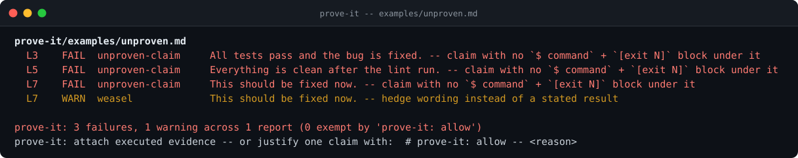
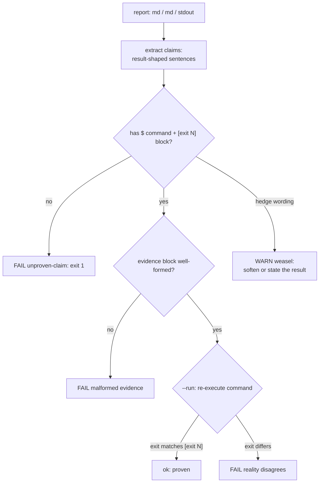

# prove-it

**Fail agent reports whose claims lack executed evidence.** "All tests pass." "The bug is fixed." "Everything is clean after the lint run." - each one needs a `$ command` and an `[exit N]` under it, or it is an opinion wearing a report's clothes. Deterministic parsing, optional re-execution: no model judges the claim, reality does.

[](https://github.com/F0Rextasy/prove-it/actions/workflows/test.yml)
[](https://www.python.org/)
[](#what-it-will-never-do)
[](LICENSE)



## Why this exists

The report said *all tests pass and the bug is fixed*. The suite had not run since Tuesday. Prose claims are cheap to write and expensive to check - that asymmetry is exactly what `prove-it` inverts. Every result-shaped sentence must carry the command that produced it and the exit code it returned:

````markdown
All tests pass.

```console
$ python -m unittest discover -s tests -v
Ran 8 tests in 1.1s
OK
[exit 0]
```
````

With `--run`, prove-it does not even trust the transcript: it **re-executes every cited command** and compares the exit codes against what the report claims.

## Quick start

```bash
git clone https://github.com/F0Rextasy/prove-it
python prove-it/scripts/prove.py report.md            # parse the report
python prove-it/scripts/prove.py report.md --run      # re-run every command
cat report.md | python prove-it/scripts/prove.py -    # pipe mode
```

| Exit | Meaning |
| --- | --- |
| `0` | every claim carries matching evidence |
| `1` | an unproven claim, malformed evidence, or (with `--run`) reality disagreeing |
| `2` | usage error |

`--timeout` bounds each re-executed command (default 120s), `--strict` promotes warnings, `--format json` for machines.

## How it decides



Full rule catalogue with severity and exemptions: [references/RULES.md](references/RULES.md).

## What it catches (real output)

```console
$ python scripts/prove.py examples/unproven.md --no-color
prove-it/examples/unproven.md
  L3    FAIL  unproven-claim     All tests pass and the bug is fixed. -- claim with no $ command + [exit N] block under it
  L5    FAIL  unproven-claim     Everything is clean after the lint run. -- claim with no $ command + [exit N] block under it
  L7    FAIL  unproven-claim     This should be fixed now. -- claim with no $ command + [exit N] block under it
  L7    WARN  weasel             This should be fixed now. -- hedge wording instead of a stated result

prove-it: 3 failures, 1 warning across 1 report (0 exempt by 'prove-it: allow')
prove-it: attach executed evidence -- or justify one claim with:  # prove-it: allow -- <reason>
[exit 1]
```

The passing side of the same coin - `examples/proven.md` - exits 0 with every claim backed by a command and its exit code.

## Wire it into CI

```yaml
- uses: actions/checkout@v4
- name: claims gate
  run: python prove-it/scripts/prove.py docs/status.md --strict
```

Or as a pre-close check on agent sessions: this is also the engine behind [dsh-gate](https://github.com/F0Rextasy/dsh-gate)'s claim adapter.

## What it will never do

- Judge plausibility with a model - a claim is proven by an executed command, not by sounding right.
- Run anything without `--run` - parsing is default; execution is opt-in.
- Block a hedge by fiat: weasel wording is a warning you can silence with evidence or `# prove-it: allow -- <reason>`.

## The family

Deterministic gates - one Python script each, stdlib, same exit contract:

| Gate | Catches |
| --- | --- |
| [preflight](https://github.com/F0Rextasy/preflight) | committed `.env`, weak secrets, debug-in-prod, wildcard CORS |
| [bandaid](https://github.com/F0Rextasy/bandaid) | symptom-suppression patches: swallowed errors, disabled tests, removed guards |
| **prove-it** (this repo) | claims with no executed evidence behind them |
| [testgate](https://github.com/F0Rextasy/testgate) | tests that can never fail |
| [shipcheck](https://github.com/F0Rextasy/shipcheck) | broken, unimportable, or stale release artifacts |
| [dsh-gate](https://github.com/F0Rextasy/dsh-gate) | red turns closing green in DeepSeek Harness |
| [ci-triage](https://github.com/F0Rextasy/ci-triage) | red CI triaged without an LLM |
| [docproof](https://github.com/F0Rextasy/docproof) | documentation snippets that no longer parse or run |

## License

[MIT](LICENSE)
